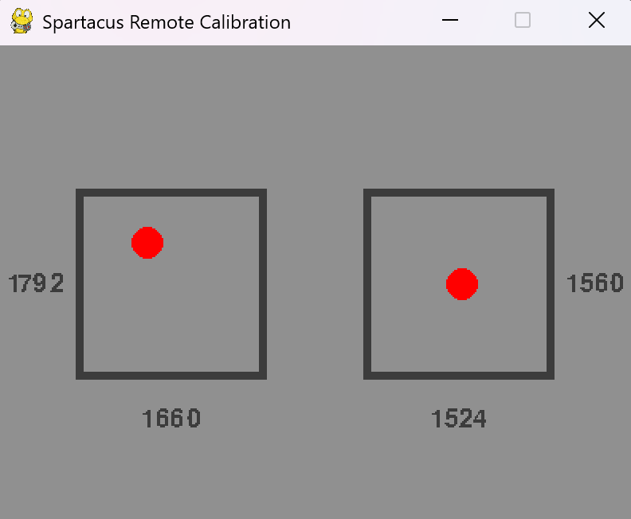

# Spartacus Combat Robot

This repository is early research and development of the electronics for the Spartacus Combat Robot. Currently working on remote control electronics. 

## Reciever

This section explains the remote system for the robot but can also be used as a standalone guide for reading DSM2 remotes from a microcontroller. The remote for Spartacus is the DMX5e RC plane controller paired with the [CM410X Reciever](https://www.aliexpress.us/item/3256806225427514.html?spm=a2g0o.order_list.order_list_main.11.35ae1802HRsKbq&gatewayAdapt=glo2usa). The testing procedure below was done using an Arduino Nano. 

NOTE: This controller is not recommended for combat robotics. Spartacus uses it since I already owned a DMX5e, but I would recommend using a different remote and receiver if purchasing the parts. 

### Binding Procedure

The `+` on the receiver is connected to the 5V pin. The `-` is connected to GND. Then, power on the receiver while holding the button. Once the LED starts flashing, release the button. Turn on the DSX5e while holding the training switch. Once the LED flashes solid they are binded. 

### Calibration

Upload `receiver.ino` to an Arduino board. Connect the pins as indicated in that script and the receiver wiring diagram. The calibration program connects to your device. Update the `PORT` values in `remote_serial.py` to match the port shown in the Arduino IDE. Change the center and deviation values in `calibration.py` so the ball reaches the edge of the box, but no farther. 