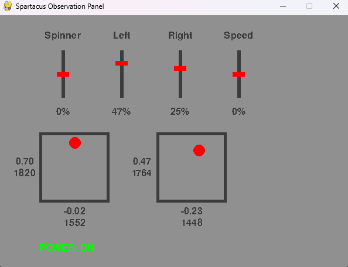

# Spartacus Combat Robot

This repository is research and development of the electronics for the Spartacus Combat Robot. Currently working on deciding on motor and ESCs. 

## Receiver

This section explains the remote system for the robot but can also be used as a standalone guide for reading DSM2 remotes from a microcontroller. Because of this, `reciever.ion` contains only the code for the receiving controller input. The remote for Spartacus is the DMX5e RC plane controller paired with the [CM410X Reciever](https://www.aliexpress.us/item/3256806225427514.html?spm=a2g0o.order_list.order_list_main.11.35ae1802HRsKbq&gatewayAdapt=glo2usa). The testing procedure below was done using an Arduino Nano. 

NOTE: This controller is not recommended for combat robotics. Spartacus uses it since I already owned a DMX5e, but I would recommend using a different remote and receiver if purchasing the parts. 

### Channels

The receiver supports four channels, each of which is used. Throttle channel ensures the Arduino knows the remote is connected. When the remote disconnects, all the channels show as if they are at rest. To ensure the microcontroller knows the remote is not connected, it will assume the remote is not connected unless the throttle is pushed forward. The rudder controls the spinner. Elevator and aileron control the movement.

### Binding Procedure

The `+` on the receiver is connected to the 5V pin. The `-` is connected to GND. Then, power on the receiver while holding the button. Once the LED starts flashing, release the button. Turn on the DSX5e while holding the training switch. Once the LED flashes solid they are binded. 

## Drive Logic

Despite the fact that there are no motors, the power that will be sent to them is calculated based on the remote input. This can be viewed in the `spartacus-controller.ino`. These values are then outputed to the observation software. 

## Observation Software

The observation software is meant to act as a convenient way of calibrating and debugging the robot. Currently, it shows the remote data and the power of each of the three motors. It also shows the theoretical speed and turn rate of the robot as a percentage. This is primarily meant to develop and test the microcontroller's logic while there are no motors attached. 

### Calibration

This software is also important for remote calibration. Upload `receiver.ino` to a microcontroller. Connect the pins as indicated in that script and the receiver wiring diagram. The observation program connects to your device. Update the `PORT` values in `remote_serial.py` to match the port shown in the Arduino IDE. Change the center and deviation values in `calibration.py` so the top value next to the box is at 0 when at rest, and 1 or -1 when pushed all the way. Note that the value below this is the number of microseconds the PWM signal is high and is the same units used by the calibration variables. 

